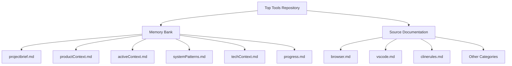
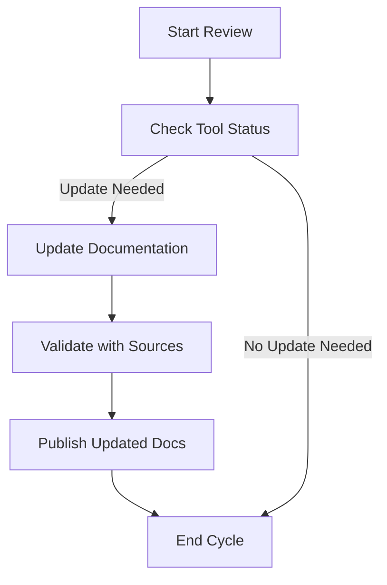

# System Patterns for Top Tools Project

## System Architecture

The Top Tools project is designed as a comprehensive repository for curating and documenting essential development
tools, browser extensions, and VSCode configurations. The architecture is primarily documentation-centric, leveraging a
structured file system to organize information and ensure accessibility. Key components include:

- **Repository Structure**: A hierarchical directory structure that categorizes tools and extensions by type (e.g.,
  browser, VSCode) and function (e.g., productivity, debugging). This structure facilitates easy navigation and
  retrieval of information.
- **Memory Bank System**: A set of Markdown files ('projectbrief.md', 'productContext.md', 'activeContext.md',
  'systemPatterns.md', 'techContext.md', 'progress.md') that serve as the central knowledge base, capturing project
  goals, context, progress, and technical details.
- **Documentation Files**: Individual Markdown files for each tool or extension, providing detailed descriptions,
  installation instructions, usage guides, and troubleshooting tips.
- **Future Automation Layer**: Planned integration of scripts or tools to automate the validation of tool status and
  documentation updates, reducing manual effort and improving accuracy.

## Key Technical Decisions

- **Markdown as Documentation Standard**: Chosen for its simplicity, compatibility with various platforms (e.g., GitHub,
  VSCode), and ease of editing. All project documentation is written in Markdown to maintain consistency and enable
  seamless integration with rendering tools.
- **Lifecycle Management for Tools**: A policy to categorize tools and extensions based on their lifecycle status
  (Active/Replaced/Deprecated). This decision ensures users are directed to current and supported solutions, enhancing
  reliability.
- **Categorization by Function and Platform**: Tools and extensions are organized based on their primary function (e.g.,
  debugging, design) and target platform (e.g., browser, VSCode). This approach was selected to align with user needs
  and improve discoverability over alternatives like alphabetical or popularity-based sorting.
- **Community Feedback Integration (Planned)**: A decision to incorporate mechanisms for user feedback and tool
  suggestions to keep the repository dynamic and responsive to developer needs. This will be implemented in future
  updates.
- **AI Assistance Exploration**: Commitment to exploring AI tools for automating documentation generation and tool
  validation, aiming to increase efficiency and maintain up-to-date content with minimal manual intervention.

## Design Patterns in Use

- **Hierarchical Organization Pattern**: Applied to the repository structure to create a logical hierarchy of categories
  and subcategories, making it intuitive for users to locate relevant tools and extensions.
- **Documentation-Driven Development**: A pattern where comprehensive documentation is created and maintained alongside
  the repository's evolution. This ensures that all tools and extensions are well-documented, supporting user adoption
  and troubleshooting.
- **Status Tagging Pattern**: Used for lifecycle management, where each tool or extension is tagged with its status
  (Active/Replaced/Deprecated) to provide clear guidance on its relevance and support level.
- **Modular Content Pattern**: Documentation for each tool or extension is contained in separate Markdown files,
  allowing for independent updates and scalability as the repository grows.

## Component Relationships

- **Memory Bank as Central Hub**: The memory bank files interlink to provide a cohesive view of the project. For
  instance, 'activeContext.md' references current focus areas that tie into tasks listed in 'progress.md', while
  'systemPatterns.md' (this file) outlines the architectural framework supporting those tasks.
- **Documentation to Tool Mapping**: Each tool or extension documented in 'src/' directories (e.g., 'browser.md',
  'vscode.md') correlates with validation and status updates tracked in memory bank files, ensuring consistency between
  detailed guides and high-level progress tracking.
- **Future Automation Integration**: Planned automation scripts will interact with both the memory bank and individual
  documentation files, updating status tags and content based on external data sources or API checks.

## Critical Implementation Paths

- **Validation Workflow**: The process for validating tool and extension status involves checking official sources
  (e.g., extension marketplaces, developer websites) for updates or deprecation notices, then updating the relevant
  documentation and memory bank files. This path is critical to maintaining repository accuracy.
- **Documentation Update Cycle**: A cycle where documentation is periodically reviewed and enhanced based on user
  feedback, tool updates, or validation outcomes. This ensures that content remains relevant and detailed, following a
  path from review to update to publication.
- **User Feedback Loop (Planned)**: A future implementation path where community suggestions and issue reports feed into
  the validation and documentation cycles, ensuring the repository evolves with user needs. This path will involve
  collecting feedback, prioritizing updates, and integrating changes into the system.

## Architectural Diagrams

### Repository Structure Overview

### Documentation Update Flow

These diagrams illustrate the structural organization of the Top Tools repository and the critical flow for maintaining
up-to-date documentation, which are central to the project's system patterns.

## Notes

- Last Updated: June 29, 2025
