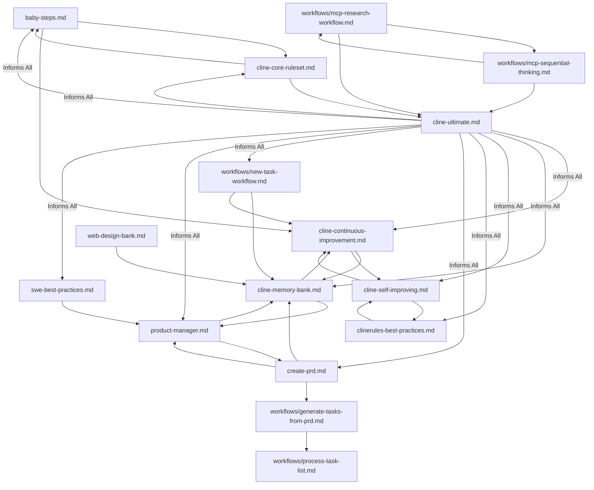

---
description:
  A unified index for cross-referencing and understanding the interactions between different .clinerules/ files.
author: Cline
version: 2.0
tags: ['index', 'cross-reference', 'clinerules-overview']
globs: ['*']
---

# ClineRules Index

This document serves as a unified index for the `.clinerules/` directory, providing an overview of all rules and mapping
their interactions and dependencies. It covers both global rules defined in the central `.clinerules/` directory and any
workspace-specific rules that may exist in individual projects. This index aims to improve navigability and coherence by
linking related guidelines, ensuring users and Cline can understand how different rules support and interact with each
other across all contexts.

## Categorized Overview of Rules

To enhance organization and navigability, the rules are logically grouped into thematic categories. While the physical
file structure remains flat, this categorization provides a structured view of the rules based on their purpose and
scope.

## Token Counts for Rule Files

To ensure that clinerule files remain concise and manageable, below are the approximate token counts (estimated as word
counts) for each rule file. Keeping rules short and to the point helps maintain clarity and efficiency in Cline's
operation.

- **baby-steps.md**: ~400 words
- **cline-continuous-improvement.md**: ~800 words
- **cline-core-ruleset.md**: ~100 words
- **cline-memory-bank.md**: ~500 words
- **cline-self-improving.md**: ~250 words
- **cline-ultimate.md**: ~300 words
- **clinerules-best-practices.md**: ~1000 words
- **clinerules-index.md**: ~800 words
- **commit-message-format.md**: ~300 words
- **create-prd.md**: ~600 words
- **product-manager.md**: ~300 words
- **swe-best-practices.md**: ~600 words
- **web-design-bank.md**: ~600 words
- **workflows/generate-tasks-from-prd.md**: ~500 words
- **workflows/mcp-research-workflow.md**: ~400 words
- **workflows/mcp-sequential-thinking.md**: ~800 words
- **workflows/new-task-workflow.md**: ~1000 words
- **workflows/process-task-list.md**: ~200 words

**Note**: These counts are approximations and serve as a guideline for maintaining brevity. Aim to keep rule files
concise to optimize Cline's processing and user comprehension.

### Core Behaviors

Rules related to Cline's fundamental operational protocols and identity.

1\. **baby-steps.md**

- **Purpose**: Establishes the Baby Steps™ Methodology as the core operational directive.
- **Key Focus**: Incremental progress, process documentation, and validation at every step.
- **Related Files**: `cline-core-ruleset.md` (collaborative operation), `cline-continuous-improvement.md` (process
  reflection).

2\. **cline-continuous-improvement.md**

- **Purpose**: Mandates self-reflection and knowledge capture for continuous improvement.
- **Key Focus**: Logging learnings, difficulties, and successes into memory bank files for long-term knowledge
  retention.
- **Related Files**: `cline-memory-bank.md` (knowledge storage), `cline-self-improving.md` (rule enhancement proposals).

3\. **cline-core-ruleset.md**

- **Purpose**: Defines collaborative operational rules for logical thinking and user interaction.
- **Key Focus**: Step-by-step reasoning, user input at key decisions, and iterative execution.
- **Related Files**: `baby-steps.md` (incremental methodology), `cline-ultimate.md` (overarching capabilities).

4\. **cline-self-improving.md**

- **Purpose**: Defines a process for reflecting on interactions and suggesting rule improvements.
- **Key Focus**: User feedback integration and rule evolution.
- **Related Files**: `cline-continuous-improvement.md` (insight consolidation), `clinerules-best-practices.md` (rule
  writing guidelines).

5\. **cline-ultimate.md**

- **Purpose**: Establishes Cline's identity as an autonomous software engineering agent.
- **Key Focus**: Technical mastery, tool usage, and comprehensive assistance scope.
- **Related Files**: All rules (defines overarching capabilities).

### Development Guides

Technical and architectural guidelines for development practices.

6\. **swe-best-practices.md**

- **Purpose**: Comprehensive guide to software engineering best practices.
- **Key Focus**: Architecture, debugging, code quality, collaboration, security, and reliability.
- **Related Files**: `product-manager.md` (user-focused engineering).

### Workflows

Rules governing task management and operational workflows.

**Note on PRD-to-Task Workflow**: The recommended sequence for managing Product Requirements Documents (PRDs) and tasks
is as follows: `create-prd.md` -> `generate-tasks-from-prd.md` -> `process-task-list.md`. This workflow ensures a
structured approach from defining requirements to generating and processing tasks.

7\. **workflows/new-task-workflow.md**

- **Purpose**: Provides instructions for task handoff strategies, especially for context window management.
- **Key Focus**: Task decomposition, handoff processes, and context preservation.
- **Related Files**: `cline-memory-bank.md` (context storage), `cline-continuous-improvement.md` (task reflection).

8\. **workflows/process-task-list.md**

- **Purpose**: Outlines guidelines for managing task lists to track progress on PRDs.
- **Key Focus**: Task implementation, completion protocol, and maintenance of relevant files.
- **Related Files**: `workflows/generate-tasks-from-prd.md` (task generation), `product-manager.md` (task planning).

9\. **workflows/generate-tasks-from-prd.md**

- **Purpose**: Defines the process for generating task lists from Product Requirements Documents (PRDs).
- **Key Focus**: Analyzing PRDs, creating high-level tasks, and detailed sub-tasks.
- **Related Files**: `create-prd.md` (PRD creation), `workflows/process-task-list.md` (task management).

10\. **workflows/mcp-research-workflow.md**

- **Purpose**: Guides the user through a research process using available MCP tools.
- **Key Focus**: Research method selection, output format, and execution using MCP tools.
- **Related Files**: `workflows/mcp-sequential-thinking.md` (problem-solving), `cline-ultimate.md` (tool usage).

11\. **workflows/mcp-sequential-thinking.md**

- **Purpose**: Guide for using the sequential thinking MCP tool for dynamic and reflective problem-solving.
- **Key Focus**: Iterative thought process, hypothesis generation, and verification.
- **Related Files**: `workflows/mcp-research-workflow.md` (research process), `cline-ultimate.md` (tool usage).

### Roles

Role-specific instructions and responsibilities.

12\. **product-manager.md**

- **Purpose**: Defines Cline's role as an experienced product manager.
- **Key Focus**: Understanding user needs, planning, and clear documentation for junior developers.
- **Related Files**: `create-prd.md` (PRD creation), `cline-memory-bank.md` (documentation).

### Processes

Specific processes, templates, or formats for various tasks.

13\. **create-prd.md**

- **Purpose**: Outlines the process for generating Product Requirements Documents (PRDs).
- **Key Focus**: Gathering user needs, structuring PRDs, and integration with project management tools.
- **Related Files**: `product-manager.md` (user needs focus), `cline-memory-bank.md` (documentation storage).

14\. **commit-message-format.md**

- **Purpose**: Provides a standardized format for commit messages.
- **Key Focus**: Ensuring clarity and consistency in version control history.
- **Related Files**: `swe-best-practices.md` (collaboration practices).

### Meta

Guidelines about rule creation, maintenance, and knowledge management.

15\. **clinerules-best-practices.md**

- **Purpose**: Offers guidance on writing effective `.clinerules/`.
- **Key Focus**: Clarity, structure, and actionable content for rule creation.
- **Related Files**: `cline-self-improving.md` (rule updates), all rules (applies to their maintenance).

16\. **cline-memory-bank.md**

- **Purpose**: Describes the Memory Bank system for maintaining project knowledge across sessions.
- **Key Focus**: Structure of core files, maintenance protocols, and documentation workflows.
- **Related Files**: `cline-continuous-improvement.md` (knowledge logging), `product-manager.md` (documentation
  standards).

### Website Development Guides

Guides specific to web development across different frameworks.

17\. **web-design-bank.md**

- **Purpose**: Resource for web design principles and practices.
- **Key Focus**: Maintaining a consistent UI/UX design system across sessions.
- **Related Files**: `cline-memory-bank.md` (documentation).

## Versioning and Changelog

- **Version 5.0**: Removed 'cline-extension-guide', 'aura-productivity-partner', and 'cline-metrics-automation' to
  streamline rules for LLM performance. Updated categorization and interaction map accordingly. (Date: 7/8/2025)
- **Version 4.0**: Removed several development guides for applications and websites, as well as presentation guides.
  Updated categorization and interaction map to reflect deletions and relocations of rules to the workflows subfolder.
  (Date: 7/8/2025)
- **Version 3.0**: Added 'baby-steps.md' and 'cline-core-ruleset.md' under Core Behaviors, removed
  'mcp-server-development.md', and moved 'mcp-research-workflow.md' and 'new-task-workflow.md' to workflows subfolder.
  Updated interaction map accordingly. (Date: 7/8/2025)
- **Version 2.0**: Updated to include categorized overview of rules for better logical organization and navigability.
  Added versioning and changelog section to track updates to the rule set. (Date: 6/16/2025)
- **Version 1.0**: Initial creation of the index with a flat list of rules and interaction map.

## Navigation Guide

Use this index to navigate the `.clinerules/` directory effectively. The categorized structure above groups rules by
thematic purpose, making it easier to locate guidelines relevant to specific aspects of Cline's operation. Refer to the
'Related Files' for each rule to understand dependencies and interactions.

## Interaction Map

<!-- markdownlint-disable MD046 -->

<!-- markdownlint-enable MD046 -->

This map illustrates how rules interact, with `cline-ultimate.md` providing overarching guidance, and other rules
supporting specific aspects like knowledge management, task workflows, and domain expertise. Note the specific workflow
for PRD-to-Task management: `create-prd.md` -> `generate-tasks-from-prd.md` -> `process-task-list.md`, which is
highlighted in the diagram as a sequential path. Additionally, various development guides for applications and websites
connect to core engineering practices and specific frameworks. Use this index to navigate the `.clinerules/` directory
effectively, understanding dependencies and related guidelines for comprehensive assistance.
