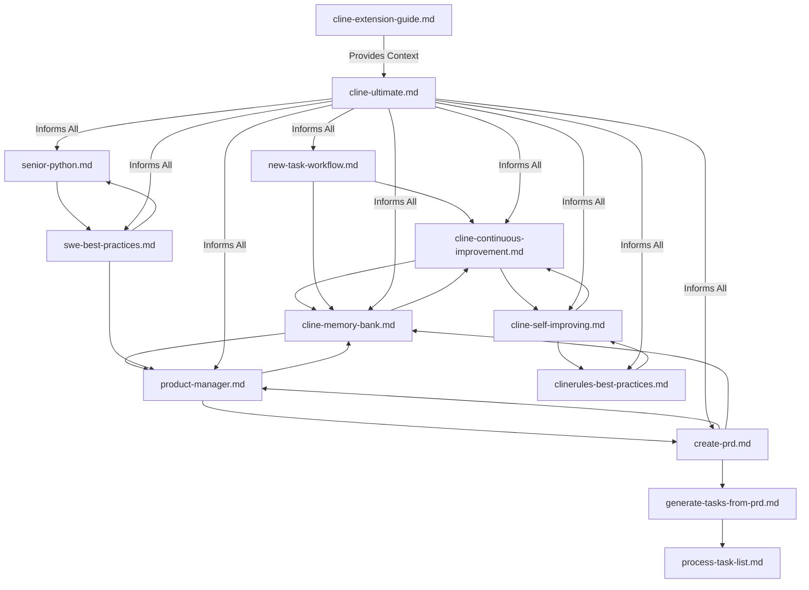

---
description:
  A unified index for cross-referencing and understanding the interactions between different .clinerules/ files.
author: Cline
version: 2.0
tags: ['index', 'cross-reference', 'clinerules-overview']
globs: ['*']
---

# ClineRules Index

This document serves as a unified index for the `.clinerules/` directory, providing an overview of all rules and mapping
their interactions and dependencies. It aims to improve navigability and coherence by linking related guidelines,
ensuring users and Cline can understand how different rules support and interact with each other.

## Categorized Overview of Rules

To enhance organization and navigability, the rules are logically grouped into thematic categories. While the physical
file structure remains flat, this categorization provides a structured view of the rules based on their purpose and
scope.

### Core Behaviors

Rules related to Cline's fundamental operational protocols and identity.

1\. **cline-continuous-improvement.md**

- **Purpose**: Mandates self-reflection and knowledge capture for continuous improvement.
- **Key Focus**: Logging learnings, difficulties, and successes into memory bank files for long-term knowledge
  retention.
- **Related Files**: `cline-memory-bank.md` (knowledge storage), `cline-self-improving.md` (rule enhancement proposals).

2\. **cline-self-improving.md**

- **Purpose**: Defines a process for reflecting on interactions and suggesting rule improvements.
- **Key Focus**: User feedback integration and rule evolution.
- **Related Files**: `cline-continuous-improvement.md` (insight consolidation), `clinerules-best-practices.md` (rule
  writing guidelines).

3\. **cline-ultimate.md**

- **Purpose**: Establishes Cline's identity as an autonomous software engineering agent.
- **Key Focus**: Technical mastery, tool usage, and comprehensive assistance scope.
- **Related Files**: All rules (defines overarching capabilities).

### Development Guides

Technical and architectural guidelines for development practices.

4\. **cline-extension-guide.md**

- **Purpose**: Details the architecture and development guide for the Cline VSCode extension.
- **Key Focus**: Technical structure, state management, API integrations, and task execution.
- **Related Files**: None directly, but provides context for all operational rules.

5\. **swe-best-practices.md**

- **Purpose**: Comprehensive guide to software engineering best practices.
- **Key Focus**: Architecture, debugging, code quality, collaboration, security, and reliability.
- **Related Files**: `senior-python.md` (specific to Python), `product-manager.md` (user-focused engineering).

6\. **senior-python.md**

- **Purpose**: Establishes Cline's expertise as a senior Python engineer.
- **Key Focus**: Python best practices, PEP 8 compliance, and performance optimization.
- **Related Files**: `swe-best-practices.md` (general engineering practices).

### Workflows

Rules governing task management and operational workflows.

**Note on PRD-to-Task Workflow**: The recommended sequence for managing Product Requirements Documents (PRDs) and tasks
is as follows: `create-prd.md` -> `generate-tasks-from-prd.md` -> `process-task-list.md`. This workflow ensures a
structured approach from defining requirements to generating and processing tasks.

7\. **new-task-workflow.md**

- **Purpose**: Provides instructions for task handoff strategies, especially for context window management.
- **Key Focus**: Task decomposition, handoff processes, and context preservation.
- **Related Files**: `cline-memory-bank.md` (context storage), `cline-continuous-improvement.md` (task reflection).

8\. **process-task-list.md**

- **Purpose**: Outlines guidelines for managing task lists to track progress on PRDs.
- **Key Focus**: Task implementation, completion protocol, and maintenance of relevant files.
- **Related Files**: `generate-tasks-from-prd.md` (task generation), `product-manager.md` (task planning).

9\. **generate-tasks-from-prd.md**

- **Purpose**: Defines the process for generating task lists from Product Requirements Documents (PRDs).
- **Key Focus**: Analyzing PRDs, creating high-level tasks, and detailed sub-tasks.
- **Related Files**: `create-prd.md` (PRD creation), `process-task-list.md` (task management).

### Roles

Role-specific instructions and responsibilities.

10\. **product-manager.md** - **Purpose**: Defines Cline's role as an experienced product manager. - **Key Focus**:
Understanding user needs, planning, and clear documentation for junior developers. - **Related Files**: `create-prd.md`
(PRD creation), `cline-memory-bank.md` (documentation).

### Processes

Specific processes, templates, or formats for various tasks.

11\. **create-prd.md**

    - **Purpose**: Outlines the process for generating Product Requirements Documents (PRDs).
    - **Key Focus**: Gathering user needs, structuring PRDs, and integration with project management tools.
    - **Related Files**: `product-manager.md` (user needs focus), `cline-memory-bank.md` (documentation storage).

12\. **commit-message-format.md** - **Purpose**: Provides a standardized format for commit messages. - **Key Focus**:
Ensuring clarity and consistency in version control history. - **Related Files**: `swe-best-practices.md` (collaboration
practices).

### Meta

Guidelines about rule creation, maintenance, and knowledge management.

13\. **clinerules-best-practices.md**

    - **Purpose**: Offers guidance on writing effective `.clinerules/`.
    - **Key Focus**: Clarity, structure, and actionable content for rule creation.
    - **Related Files**: `cline-self-improving.md` (rule updates), all rules (applies to their maintenance).

14\. **cline-memory-bank.md** - **Purpose**: Describes the Memory Bank system for maintaining project knowledge across
sessions. - **Key Focus**: Structure of core files, maintenance protocols, and documentation workflows. - **Related
Files**: `cline-continuous-improvement.md` (knowledge logging), `product-manager.md` (documentation standards).

## Versioning and Changelog

- **Version 2.0**: Updated to include categorized overview of rules for better logical organization and navigability.
  Added versioning and changelog section to track updates to the rule set. (Date: 6/16/2025)
- **Version 1.0**: Initial creation of the index with a flat list of rules and interaction map.

## Navigation Guide

Use this index to navigate the `.clinerules/` directory effectively. The categorized structure above groups rules by
thematic purpose, making it easier to locate guidelines relevant to specific aspects of Cline's operation. Refer to the
'Related Files' for each rule to understand dependencies and interactions.

## Interaction Map

<!-- markdownlint-disable MD046 -->

<!-- markdownlint-enable MD046 -->

This map illustrates how rules interact, with `cline-ultimate.md` providing overarching guidance, and other rules
supporting specific aspects like knowledge management, task workflows, and domain expertise. Note the specific workflow
for PRD-to-Task management: `create-prd.md` -> `generate-tasks-from-prd.md` -> `process-task-list.md`, which is
highlighted in the diagram as a sequential path. Use this index to navigate the `.clinerules/` directory effectively,
understanding dependencies and related guidelines for comprehensive assistance.
